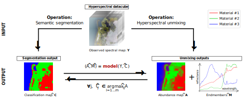
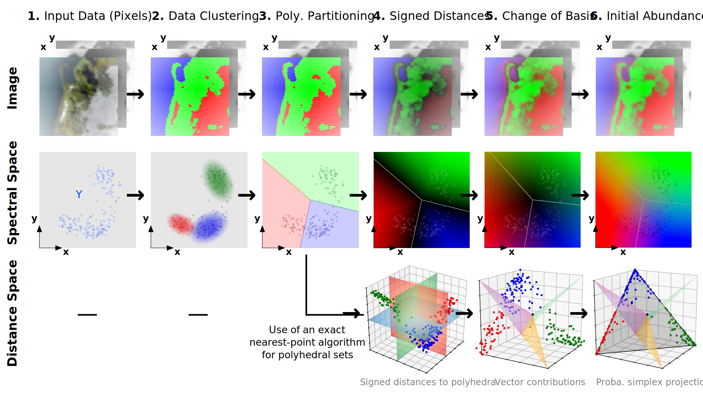

# polyhedral-unmixing

Python code for **Polyhedral Unmixing**: unsupervised segmentation-to-unmixing model for linear spectral unmixing via polyhedral partitioning of space.

Examples with **Samson**, **Jasper Ridge** and **Urban-6** hyperspectral datasets in the blind setting (see notebooks).

The code is based on the papers **[1]**, **[2]** and was developed on Linux - Ubuntu 22.04.

## Citations

If you find the code useful, please cite us as follows.

```
@article{..., 
  author = {Bottenmuller, Antoine and Decenci\`ere, Etienne and Dokl\'adal, Petr}, 
  title = {Polyhedral Unmixing ...}, 
  year = {2026}
}
```

```
@article{..., 
  author = {Bottenmuller, Antoine and Decenci\`ere, Etienne and Dokl\'adal, Petr}, 
  title = {Abundance Estimation ...}, 
  year = {2027}
}
```

## Context

Polyhedral Unmixing makes a **direct bridge** between spectral image **classification** (semantic segmentation) and **unmixing**, as illustrated in the figure below, via a theoretical characterization of the so-called **dominant-material regions** in the spectral space $`\mathbb{R}^d`$.

Under the linear mixing model (LMM), these regions are **polyhedral cones** when endmembers are linearly independent (see paper [1]), or can be constructed as more general **polyhedral sets** under linear dependence via a limit-based formulation (see paper [2]), forming a **partition** of $`\mathbb{R}^d`$.

We leverage this property to propose a **new unmixing pipeline** that, from an input **spectral image** $`Y`$ and associated **pixel labels** $`\hat{C}`$, computes **endmember** $`\hat{M}`$ and **abundance** $`\hat{A}`$ estimates via a **polyhedral partitioning** of $`\mathbb{R}^d`$ that approximates the true dominant-material regions, and a **distance-based formulation** of initial abundances associated with the polyhedral regions.

The pipeline of the proposed method is described in the next section.



## Proposed Model

The Polyhedral unmixing model follows the pipeline illustrated in the figure below (with $`m=3`$ materials).

From a given input **spectral dataset** (col. 1.) and **classification map** (or clustering model) with $`m`$ materials (col. 2.), the model first determines a **polyhedral partition** of the spectral space $`\mathbb{R}^d`$ (col. 3.) that best fits the labeled pixels, as an approximation of the true dominant-material regions.

**Signed distances** to the $`m`$ polyhedral sets are then computed for each pixel (col. 4.); a **change of basis** is performed in the signed-distance space $`\mathbb{R}^m`$ with extremal-distance vectors as new basis (col. 5.); and the new data is **projected** onto the probability simplex, finally yielding an **initial abundance estimate** $`\hat{A}_\text{init}`$ (col. 6.).

Under linear independence of the endmembers, an **endmember estimate** $`\hat{M}`$ and **final abundances** $`\hat{A}`$ can be deduced from $`\hat{A}_\text{init}`$ via matrix pseudo-inversion.

See papers **[1]**, **[2]** for a detailed method presentation.



## Repository Structure

- **datasets/**: Folder dedicated to datasets ($`Y`$) and their ground-truths (endmembers $`M`$ and abundances $`A`$).
- **figures/**: Folder containing the figures used to illustrate this README and the Polyhedral Unmixing model.
- **src/**: Main source code.
  - `unmixing.py`: Main unmixing functions and class.
  - `datasets.py`: Downloading and loading datasets.
  - `display.py`: Displaying datasets and results.
  - `metrics.py`: Evaluation of unmixing results.
  - `polyset.py`: Functions for polyhedral computation.
  - `min_norm_point_DAQP.py`: Minimal-norm point algorithm using DAQP solver.
  - `min_norm_point_PYTHON.py`: Minimal-norm point algorithm using our own solver in Python.
  - `min_norm_point_C/`: Minimal-norm point algorithm using our own solver in C (requires compilation).
- **example_<...>.ipynb**: Example notebooks applying the unmixing model to datasets, with results.
- **requirements.txt**: List of required Python packages.
- **LICENSE**: MIT license for this software.
- **README.md**: This file.

## Creating a Virtual Environment (venv)

```bash
python3 -m venv ./env     # create virtual environment
source env/bin/activate   # activate environment
```

## Installing Dependencies

```bash
pip install -r requirements.txt   # install Python packages
```

In order to use the C version of our minimal-norm point solver, please install GLPK and compile the `min_norm_point` package using the following commands (for Linux):
```bash
sudo apt-get install glpk-utils libglpk-dev glpk-doc   # install GLPK
pip install ./src/min_norm_point_C   # compile & install C minimal-norm point package
```

⚠️ If the second command fails, follow the instructions in `src/min_norm_point_C/README.md` for manual compilation.

You can also use either DAQP (`min_norm_point_DAQP.py`) or the Python version of our MNP algorithm (`min_norm_point_PYTHON.py`) instead, but note that the latter is about **100× slower** than the C version.

## Using the Code

Please download and drop the datasets in the **datasets/** folder (see `datasets/README.md`). 
This may be done either manually or automatically using the **load** functions provided in `datasets.py`. 
Open and run one of the three Notebooks as an example.

To use the main unmixing model, import the **PolyhedralUnmixingModel** class and initialize it via
```python
# Import the Polyhedral Unmixing Model class
from src.unmixing import PolyhedralUnmixingModel

# Initialize the model with given arguments
model = PolyhedralUnmixingModel(*init_args)
```
Then, **fit** the model by passing the indicated arguments and **predict** unmixing matrices over your input spectral image. 

**Two main uses of the same model are possible:**

### **1.** Predict both endmembers and abundances **[1]**

Under linear independence of the endmembers, both endmembers $`\hat{M}`$ and abundances $`\hat{A}`$ can be estimated via matrix pseudo-inversion from an inital abundance estimate $`\hat{A}_\text{init}`$ computed by the Polyhedral model over $`Y`$. See paper **[1]**. Use the following functions to **(i) fit** the model and **(ii) predict** endmembers and associated abundances.

**$`\Rightarrow`$ Fit the model:**
```python
model.fit(*args)
```

**$`\Rightarrow`$ Predict endmembers and abundances:**
```python
M_hat, A_hat = model.predict(Y)
```

You can also use **M_hat, A_hat = model.fit_predict(Y, \*args)** to fit and predict at the same time.

### **2.** Predict initial abundances alone **[2]**

Under linear dependence of the endmembers, matrix pseudo-inversion is either not stable or impossible, and the search for a couple $`(\hat{M}, \hat{A})`$ is an underdetermined problem: even if $`\hat{M}`$ (resp. $`\hat{A}`$) is given, there are infinitely-many possible $`\hat{A}`$ (resp. $`\hat{M}`$) matrices that all minimize the squared Frobenius norm $`\|\hat{M} \hat{A} - Y\|^2_F`$. Abundances can however be estimated without any endmember identification using the inital abundance estimate $`\hat{A}_\text{init}`$ given by the Polyhedral model over $`Y`$ via a limit-based formulation of dominant-material regions. See paper **[2]**. Use the following functions to **(i) fit** the initial model components and **(ii) predict** initial abundances.

**$`\Rightarrow`$ Fit the model** (optional, if .fit has not been used yet)**:**
```python
model.fit_initial(*args)
```

**$`\Rightarrow`$ Predict initial abundances:**
```python
A_init = model.predict_initial_abundances(Y)
```

You can also use **A_init = model.fit_predict_initial_abundances(Y, \*args)** to fit and predict at the same time.

## References

This code is based on our two papers available online:

**[1]** ...

Open access: ...

**[2]** ...

Open access: ...

